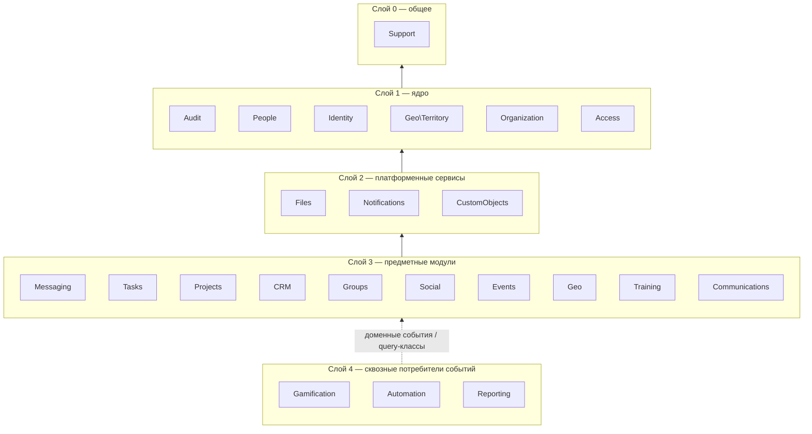

# Граф зависимостей модулей

> Источник: ТЗ §10–11, §44, §64, §83; ФО §6–7. Предварительный граф — уточняется по мере реализации фаз. Каждое изменение рёбер фиксируется здесь и, по возможности, закрепляется архитектурным тестом.

## Правила

1. Зависимости направлены только **вниз** по слоям (ниже — ядро, выше — потребители).
2. Сквозные модули-потребители (**Gamification**, **Automation**, **Reporting**, частично **Audit** и **Notifications**) узнают о происходящем через **доменные события** (ТЗ §44) и read-only query-классы, а не вызывают внутренности модулей-производителей.
3. Любая проверка доступа — только через **Access** (ТЗ §15, §64). Ни один модуль не содержит собственной логики прав.
4. Внешние системы — только через `app/Infrastructure/*` (ТЗ §2).

## Слои

## Прямые зависимости (кто кого использует)

| Модуль | Зависит от | Примечание |
|---|---|---|
| Support | — | |
| Audit | Support | Журнал событий ядра (Д-4, ADR-006) — реализуется первым. Все модули пишут в него только через API `EventJournal` или доменные события, в той же транзакции, что и действие |
| People | Audit | `Person` — каноническая сущность человека (ТЗ §12) |
| Identity | People, Audit | `User` ссылается на `Person` (1:0..1) |
| Geo\Territory | Audit | Ядро модуля Geo: дерево территорий страна → участок (Д-1). Без зависимостей от предметных модулей |
| Organization | People, Geo\Territory, Audit | `OrgUnit` — дерево подразделений; привязка к 0..N территориям (Д-3) |
| Access | Identity, Organization, Geo\Territory, People, Audit | Роли, разрешения, две оси scopes (территория и оргструктура), наследуемый и выданный территориальный доступ (Д-3), делегирование; единственная точка проверки прав |
| Profiles | People, Organization, Access, Audit | Открытый профиль с видимостью полей и конфиденциальные слои (фаза 2). Круги видимости строятся на `OrgStructure` и `TerritorialAccess` |

**Уточнение фазы 7.** Полевая часть Geo знает о Tasks (задача «вернуться» — и отношение-допуск на её создание), об Events (мероприятие с точкой привязывается к геозонам; Events о Geo не знает — привязка идёт по событию сохранения модели) и о CRM (обращения жителей, привязанные к дому). Access получил общий локатор `TerritoryColumnLocator` для объектов, стоящих в одной территории. Событие `Geo\Events\VisitCompleted` — для геймификации, `GeoZoneCrossed` — для автоматизации ([ADR-013](../decisions/ADR-013-field-work-offline-maps.md)).

**Уточнение фазы 6.** Messaging не импортирует Tasks, Projects и Groups: модуль объекта сам регистрирует в `Messaging\ChatSubjects` правило доступа к своему обсуждению, название и ссылку. Создание задачи из ветки — на стороне панели: она берёт выжимку у Messaging и вызывает действие Tasks. Social, Events и Messaging зависят от порта `Files\AttachmentScanner`; адаптер ClamAV — в `Infrastructure\Antivirus` ([ADR-012](../decisions/ADR-012-messenger-realtime-antivirus.md)).

**Уточнение фазы 5.** С фазы 5 Tasks, CRM, Groups, Social и Events зависят от Notifications: регистрируют в нём свои категории уведомлений и секции дайджеста, а их классы уведомлений используют общий трейт маршрутизации. CRM слушает событие `Events\AttendanceMarked` и ведёт факт «посещение мероприятия» в ленте человека — таблицы Events он не читает.

**Уточнение фазы 3.** Модули, у которых есть колонки, указывающие на человека, регистрируют их в `People\PersonReferences` (в своих сервис-провайдерах) — слияние карточек перенаправляет ссылки, не зная об этих модулях ([ADR-009](../decisions/ADR-009-crm-registry-merge-import.md)). `PersonLocator` в Access читает территорию и ответственное подразделение карточки для людей вне оргструктуры.

**Уточнение фазы 2.** Actions ядра (Organization, Identity, People, Geo\Territory) проверяют права вызовом `AuthorizationService` во время выполнения — это единственное ребро «вверх» к Access и оно допустимо по правилу 3. Обратно Access не импортирует Actions других модулей: модули сами регистрируют в нём свои локаторы областей (`ScopeLocator`) и отношения «Св» в своих сервис-провайдерах ([ADR-008](../decisions/ADR-008-access-scopes.md)). Деактивация пользователя доходит до Tasks доменным событием `UserDeactivated`.
| Files | Access, Audit | Вложения и версии документов |
| Notifications | Identity, Access, People, Audit | Уведомление не раскрывает то, что получатель не вправе видеть (ТЗ §37) |
| CustomObjects | People, Access, Audit | Не обходит общую авторизацию (ТЗ §42). С фазы 3 — пользовательские поля карточки человека; значения следуют правам на саму запись |
| Messaging | People, Identity, Access, Catalogs, Files, Notifications, Audit | Обсуждения объектов (`Discussions`) — с фазы 2; полный мессенджер — с фазы 6. Об объектах обсуждений знает только через реестр `ChatSubjects` |
| Tasks | People, Organization, Access, Messaging, Files, Notifications | Задача ссылается на чат обсуждения (ТЗ §21) |
| Projects | Tasks, Organization, People, Access | |
| CRM | People, Profiles, Organization, Geo\Territory, Access, Tasks, CustomObjects, Catalogs, событие Events | `Lead` ссылается на `Person`, не дублирует его (ТЗ §26). Узнаёт о новых и изменённых карточках по событию `PersonSaved`; сообщает о перемещениях доменными событиями `LeadStageChanged`, `AppealStatusChanged` |
| Groups | People, Identity, Organization, Geo\Territory, Projects, Access, Messaging, Audit | С фазы 4. Привязка группы к подразделению, территории или проекту; чат группы — `Discussions`. Files — когда появится модуль файлов: сейчас «файлы группы» — вложения её постов |
| Social | Groups, People, Identity, Organization, Geo\Territory, Access, Catalogs, Audit | С фазы 4. Региональная видимость постов — по `Territory` (Д-1) и `TerritorialAccess` (Д-3); видимость групповых постов — `GroupAccess`. Реакции и причины жалоб — справочники. Notifications и Files — с фаз 5–6 ([ADR-010](../decisions/ADR-010-social-visibility-groups-api.md)) |
| Events | Groups, People, Identity, Organization, Geo\Territory, Access, Catalogs, Notifications, Audit | С фазы 5. Видимость — по `Territory`, `TerritorialAccess` и `GroupAccess`, как у постов. Сообщает о посещении доменным событием `AttendanceMarked`. Гео-точка — пока координаты; карта — через `GeoService` в фазе 7 ([ADR-011](../decisions/ADR-011-events-and-notifications.md)) |
| Geo (полевая часть) | Geo\Territory, People, Identity, Organization, Access, Catalogs, Tasks, Events, CRM, Notifications, Audit | С фазы 7. Дома, квартиры, визиты, геозоны, местоположение, транспорт; все пространственные операции — только `GeoService` (ТЗ §32) |
| Training | People, Access, Notifications | |
| Communications | CRM, People, Access, Infrastructure/Chatwoot | Цепочка «канал → человек → лид/обращение → задача» (ТЗ §29) |
| Gamification | события Tasks, Training, Geo, Events | XP только из подтверждённых доменных событий (ТЗ §36) |
| Automation | события всех модулей; вызывает их Actions | Каждое выполнение — `AutomationRun` (ТЗ §41) |
| Reporting | query-классы модулей, Access | Каждый запрос отчёта проходит через scopes (ТЗ §40) |

## Инфраструктурные адаптеры

| Адаптер | Используется модулями |
|---|---|
| `ExternalAuth` | Identity (OAuth/OIDC-провайдеры) |
| `Chatwoot` | Communications |
| `Search` | все модули через `SearchService` (ТЗ §39) |
| `Storage` | Files |
| `Maps` | Geo — плитки карты у внешнего провайдера, переключается в настройках (с фазы 7) |
| `Calendar` | Events (Google Calendar, ICS, iCal) |
| `Antivirus` | Files (`AttachmentScanner`: ClamAV или «без проверки») — с фазы 6 |
| `AI` | через `AiService` (ТЗ §45) |
