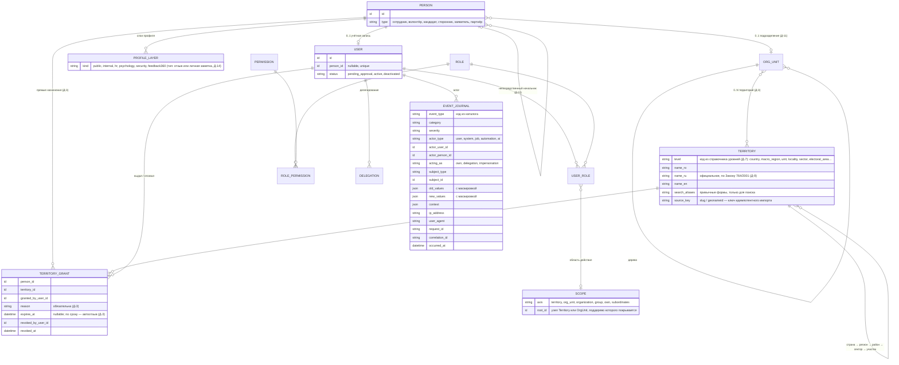
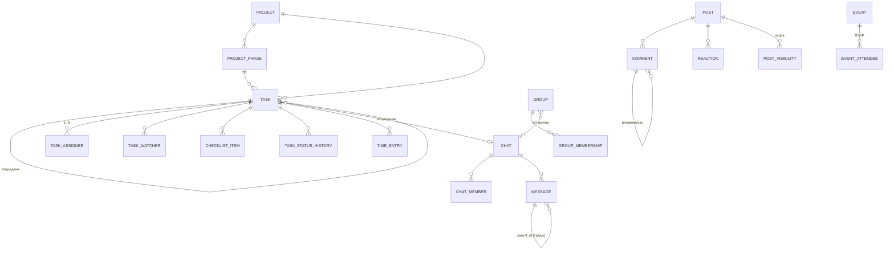
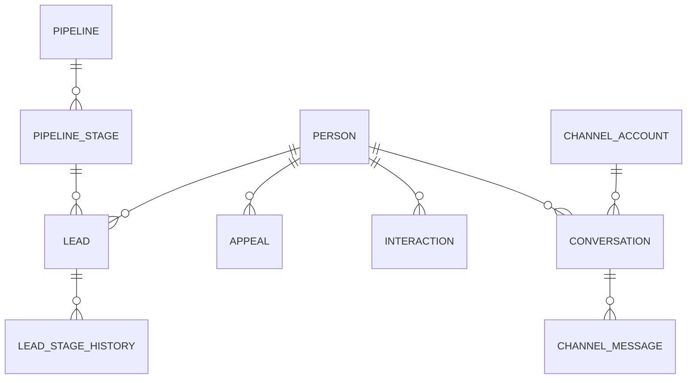
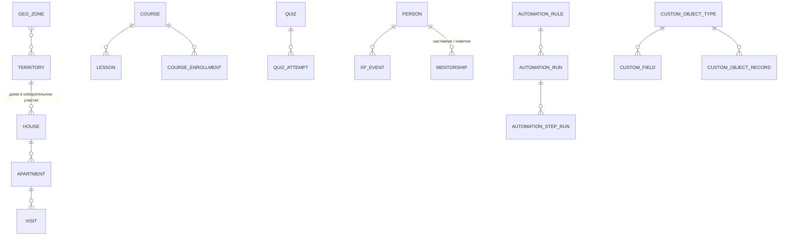

# Логическая модель данных (первичная)

> Источник: ТЗ §11–12, §16, §18–28, §31, §35–36, §41–42; ФО §6–8. Это **логическая** модель: сущности и связи. Физическая схема (колонки, индексы) проектируется в фазе, где модуль реализуется, и фиксируется миграциями.

## Ядро: люди, учётные записи, территории, оргструктура, доступ, аудит

Ключевые правила:
- «Регион / район / сектор» — узлы `Territory`, а не подразделения (Д-1). Области прав имеют две независимые оси: территориальную и оргструктурную.
- `OrgUnit` привязывается к нескольким территориям или ни к одной (Д-3).
- Действующий территориальный доступ человека = территории его подразделения (сотрудник состоит ровно в одном, Д-11) ∪ действующие `TERRITORY_GRANT` (не отозванные и не истёкшие). Это вычисляемое значение, не хранимое поле; для быстрых выборок допустим кэш с инвалидацией по событиям (ТЗ §55).
- `EVENT_JOURNAL` — журнал событий ядра (Д-4, ADR-006): только добавление; запись — в одной транзакции с действием.
- `Person` существует без `User`; обратное невозможно после фазы 1 — у каждой учётной записи есть человек (самостоятельная регистрация всегда создаёт новую карточку, привязка к существующей — только вручную, Д-10).
- Конфиденциальные слои — отдельные сущности (`PersonInternalProfile`, `PersonHrProfile`, `PersonPsychologyNote`, `PersonSecurityNote`, `PersonFeedback360`), а не поля `people` (ТЗ §16). На схеме они обобщены как `PROFILE_LAYER`.

## Совместная работа

- Исполнители и наблюдатели задачи — `Person` с активной учётной записью `User` (Д-15); человек без учётной записи может быть только предметом задачи через `TaskRelation`.
- Задача может ссылаться на `Person`, `Project`, `ProjectPhase`, `House`, `Apartment`, `Event`, `Appeal`, `Lead`, `CustomObjectRecord` (ТЗ §24) — полиморфная связь `TaskRelation`.
- Лента — проекция над `Post`, без копий (ТЗ §18).

## CRM и коммуникации

## Гео, обучение, геймификация, платформа

Дерево `Territory` относится к ядру (см. выше, фаза 2). Полевая часть Geo добавляет к нему:

- `XpEvent` всегда хранит `source_event`, `actor`, `reason`, `amount` (ТЗ §36).
- `DataEvent` (структурированные факты, ФО §5.3) привязывается к любому объекту полиморфно.
